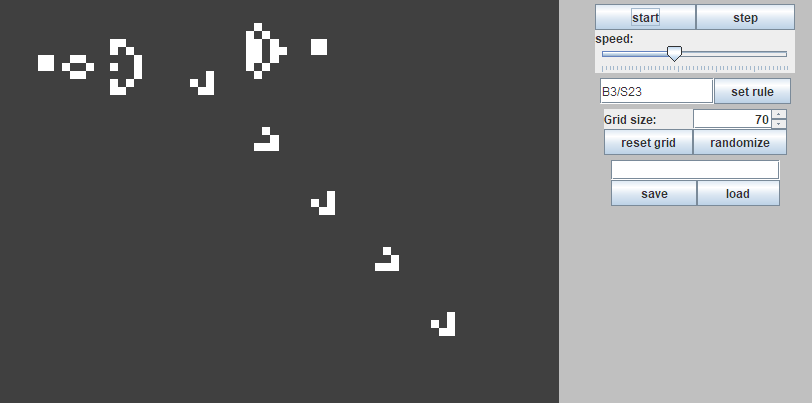

# Sejtautomata

A program célja a John Conway-féle sejtautomata játék különböző variációinak szimulálása, a
szimuláció grafikus megjelenítése.

## A játék

A szimuláció egy négyzet alakú rácson történik. A cellák minden iterációban "élő" vagy "halott"
állapotban vannak. A következő iterációbeli állapotuk az élő szomszédjaik száma és a saját állapotuk
alapján dől el. (Szomszédosak azok a cellák, amiknek van közös csúcsuk.) Tehát egy élő cella
"meghalhat" és egy halott cella "megszülethet" attól függően, hogy hány szomszédja él.

A játék-variációk a szabályrendszerükben különböznek. A szabályok arra vonatkoznak, hogy milyen
számú élő szomszéd esetén születik meg egy halott, illetve marad életben egy élő cella. Ezt a két
számhalmazt a következő módon jelöljük:

Például a "B3/S23" kód a John Conway által kitalált népszerű verzióját jelenti a játéknak. A kód két
részre oszlik: A B (born) után következő számjegyek a '/' jelig határozzák meg, hogy milyen számú élő
szomszéd esetén születik meg egy halott cella. Az S (survive) után következő számjegyek pedig a
túlélést jelentő számok. (A példában 3 élő szomszédnál a halott cella megszületik és 2 vagy 3 élő
szomszédnál az élő cella életben marad, különben meghal.)

## Buildelés és futtatás

A buildeléshez JDK és Apache Ant szükséges. Fontosabb Ant targetek:

- `ant jar`: futtatható jar létrehozása
- `ant doc`: javadoc létrehozása
- `ant run`: buildelés és futtatás

## A program funkciói

A program képes a szimulációt valós időben futtatni, a különböző szabályrendszereket alkalmazni, a
táblát módosítani. A tábla állását és a szabályrendszert fájlba lehet menteni, onnan be lehet tölteni.

Indításakor egy főmenü jelenik meg. Itt lehet választani, hogy egy korábban mentett fájlt szeretnénk
betölteni vagy alapállásból indítjuk a szimulációt. Ezután a szimulációs ablak jelenik meg, ahol a táblát
láthatjuk, mellette pedig a vezérlő komponenseket. Ezekkel lehet a szimulációt elindítani/megállítani,
a sebességet állítani, a szabályrendszert és a tábla méretét módosítani. Az állást lehet törölni és
randomizálni. Menteni és betölteni is lehet innen. Az egyes cellák állapotát rájuk kattintva tudjuk
kapcsolni. Ezeket a műveleteket csak akkor végezhetjük el, ha a szimulációt megállítottuk.

A demos könyvtárban elérhető néhány a programhoz előre elkészített demonstráció. Ezeket a mentésekhez
hasonlóan be lehet tölteni.

## Példák

*"Glider gun" konstrukcio az eredeti szabályrendszerben.*

*Növekvő minta a "Seeds" szabályrendszerben.*

*Növekvő "jégkristály" a "snowflakes" szabályrendszerben.*

*Önmagát sokszorozó "Replicator" minta*

